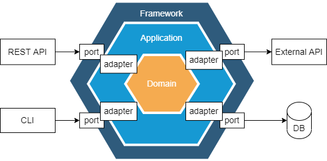
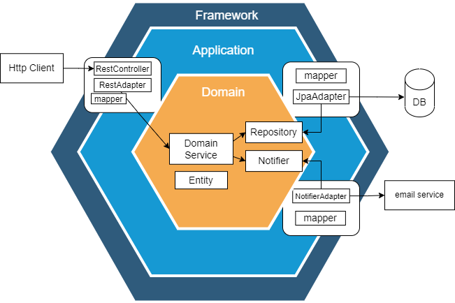

# A quick and practical example of Hexagonal Architecture in Java


## 1. Overview

The Hexagonal Architecture is a software architecture that allows us to focus on the **core logic** of our application and 
keep a **loose coupling** between the core domain and the components around it.

In this article, we'll use the Hexagonal Architecture to build a testable and portable java application for managing and booking the rooms for a hotel.


## 2. Principles

We will achieve this loosely coupled, testable, and portable architecture through a series of **logical boundaries** which will divide
our application into small, decoupled, components.

Each of these components belongs to one of the three main layers:
- the **Framework** layer - holds framework-specific configuration and allows leverages with the *outside world*
- the **Application** layer - acts as a mediator for the Domain Layer: validating and mapping the data coming in  
- the **Domain** layer - is responsible for *all* the business logic

The main principle is to have each of these layers independent of the outer ones.

This will allow us to change any component from the outer layers without affecting the business logic.


## 3 Ports and Adapters

This architecture is also known as **"Ports and Adapters"**.
Let's look at the following diagram and observe what is the role of the ports and adapters.




### 3.1 Ports

At the edge of the hexagon, we can observe the '**ports**': all the communication with the exterior will be done through them.
They should not contain any logic at all.

The ports from the left side of the diagram are also called **primary** ports, because they **drive** the application. 
In our case, the client can access the application through them using either the REST API or the CLI. 

On the other hand, the ports from the right side of the diagram are called **secondary** ports and they are **driven** by the application. 
They are used to communicate to other components such as external APIs, data sources, and others.

### 3.2 Adapters

The purpose of the **Adapters** is to process the data coming from the outer layer by validating it, transforming it into business objects, and passing it to the inner layer.

The Adapters can also wrap external dependencies, providing a nicer API and a return type that is more suited to the caller's context.

## 4. The Domain Layer

The **Domain Layer** should be built with objects which are meaningful from a business perspective. Let's look at our application and try to identify these objects:

*HotelRoom* is an **entity**. Entities should hold data and enrich it with methods containing business logic for validating and updating their internal state. 

```java
public class HotelRoom {

    enum Status {
        AVAILABLE, ROUTINE_MAINTENANCE, HOSPITALITY_CLEANING, TEMPORARY_UNAVAILABLE
    }

    private final String roomNumber;
    private Status status;
    private Map<UUID, Booking> bookings;

    // constructor

    public void book(Booking booking) {
        if(status != Status.AVAILABLE) {
            throw new IllegalStateException(String.format("the room %s is not AVAILABLE for booking.", roomNumber));
        }
        checkAvailability(booking.getPeriodDetails());
        bookings.put(booking.getUuid(), booking);
    }

    public void startRoutineMaintenance() {
        validateRoomStatus();
        this.status = Status.ROUTINE_MAINTENANCE;
    }

    public void startHospitalityCleaning() {
        validateRoomStatus();
        this.status = Status.HOSPITALITY_CLEANING;
    }

    private void validateRoomStatus() {
        // business logic
    }

    private void checkAvailability(PeriodDetails period) {
        // business logic
    }

    // getters
}
```

Notice the way the encapsulation mechanism works for the *HotelRoom* class: 
The internal data of an instance can only be changed through the three public methods **and only** if the business validation passed.
**This will ensure that, at any given time, we will have valid business data inside**.

```java
public class Booking {
    private UUID uuid;
    private FullName bookingName;
    private PeriodDetails periodDetails;

    // constructor and getters
}

public class PeriodDetails {
    private LocalDate startDate;
    private LocalDate endDate;

    public int getPeriodInDays() {
        return Period.between(startDate, endDate).getDays();
    }

    // constructor and getters
}

public class FullName {
    private String firstName;
    private String lastName;

    public String get() {
        return firstName + " " + lastName.toUpperCase();
    }

    // constructor and getters
}
```

The *Booking* class doesn't expose any methods for changing its internal data. We can even mark the fields as *final* to emphasize and guarantee their immutability.

We can observe that it encapsulates some of the fields into small objects without an identity, such as *FullName* and *PeriodDetails* - these objects are also known as **Value Objects**.

The *HotelBookingService* is a **Domain Service**. The domain services are implementing more complex use-cases where we need multiple entities or communication with the exterior world.

```java
public class HotelRoomBookingService {

    private HotelRoomRepository hotelRoomRepository;
    private StaffMembersNotifier staffNotifier;

    // constructor

    public Booking addBooking(String roomNumber, Booking booking) {
        HotelRoom room = hotelRoomRepository.findByRoomNumber(roomNumber);
        room.book(booking);

        hotelRoomRepository.save(room);
        return booking;
    }

    public HotelRoom startRoutineMaintenance(String roomNumber) {
        HotelRoom room = hotelRoomRepository.findByRoomNumber(roomNumber);
        room.startRoutineMaintenance();
        staffNotifier.sendNotification(new StaffMembersNotification(MAINTENANCE, roomNumber));

        hotelRoomRepository.save(room);
        return room;
    }

    public HotelRoom startHospitalityCleaning(String roomNumber) {
        HotelRoom room = hotelRoomRepository.findByRoomNumber(roomNumber);
        room.startHospitalityCleaning();
        staffNotifier.sendNotification(new StaffMembersNotification(CLEANING, roomNumber));

        hotelRoomRepository.save(room);
        return room;
    }
}
```

Now, let's see how the *HotelRoomRepository* and *StaffMembersNotifier* look:

```java
public interface StaffMembersNotifier {
    void sendNotification(StaffMembersNotification notification);
}

public interface HotelRoomRepository {
    HotelRoom findByRoomNumber(String flightNumber);

    void save(HotelRoom flight);
}
```

They are both interfaces, **secondary ports** through which the domain services will communicate with other external components.

**This abstraction is crucial for achieving the total independence of the domain layer.**

At this point, the domain service is not aware of how the data is persisted and retrieved. We can have a direct connection to a database, an HTTP call to an external service for persistence, or any other implementation: either way, the domain will behave the same.

This also means that we can already write the unit tests for the domain layer, only by mocking or creating test doubles for the two dependencies.  

```java
@ExtendWith(MockitoExtension.class)
public class HotelRoomBookingServiceTest {

    @Mock
    private StaffMembersNotifier staffMembersNotifier;
    private HotelRoomRepository hotelRoomBookingRepository;
    private HotelRoomBookingService hotelRoomBookingService;

    @BeforeEach
    void beforeEach() {
        hotelRoomBookingRepository = new HotelRoomRepositoryTestImpl();
        hotelRoomBookingService = new HotelRoomBookingService(hotelRoomBookingRepository, staffMembersNotifier);
    }

    @Test
    void givenAHotelRoom_whenWeBookIt_thenBookingShouldBeSaved() {
        hotelRoomBookingRepository.save(new HotelRoom("101A"));

        hotelRoomBookingService.addBooking("101A", aBooking());

        Booking savedBooking = getSavedBooking("101A", "6246fe1c-8c49-11ec-a8a3-0242ac120002");
        assertThat(savedBooking.getBookingName().get()).isEqualTo("John DOE");
        assertThat(savedBooking.getPeriodDetails().getPeriodInDays()).isEqualTo(3);
    }

    @Test
    void givenAHotelRoomInMaintenance_whenWeTryToBookIt_thenWeGetTheApproptiateException() {
        hotelRoomBookingRepository.save(new HotelRoom("101A"));
        hotelRoomBookingService.startRoutineMaintenance("101A");

        assertThatThrownBy(() -> hotelRoomBookingService.addBooking("101A", aBooking()))
            .isInstanceOf(IllegalStateException.class)
            .hasMessage("the room 101A is not AVAILABLE for booking.");
    }

    @Test
    void givenAHotelRoom_whenWeRequestRoutineMaintenance_thenTheMaintenanceTeamIsNotified() {
        hotelRoomBookingRepository.save(new HotelRoom("101A"));

        hotelRoomBookingService.startRoutineMaintenance("101A");

        verify(staffMembersNotifier).sendNotification(argThat(notification ->
            notification.getRoomNumber().equals("101A") && notification.getTeam() == Team.MAINTENANCE));
    }

    // helper methods
}
```

We have used Mokito to mock for *StaffMembersNotifier*, while, for *HotelRoomRepository*, we wrote a test double which stores the booking objects in a *HashMap*.

## 5. The Application Layer

The application layer it's composed of both primary (incoming) and secondary (outgoing) ports and their respective adapters.
Let's take a look at the primary ones first.

### 5.1. Driving Port/Adapters

In our example, the incoming port is represented by the *HotelRoomController* and its adapter is *HotelRoomRestAdapter*.

The controller only defines the structure of the API and delegates the commands to the adapter.

```java
@RestController
@RequestMapping("api/rooms")
public class HotelRoomController {
    private HotelRoomRestAdapter hotelRoomRestAdapter;

    // constructor

    @PostMapping("{roomNumber}/bookings")
    public BookingDto addBooking(@PathVariable String roomNumber, @RequestBody BookingDto dto) {
        return hotelRoomRestAdapter.addBooking(roomNumber, dto);
    }

    @PatchMapping("{roomNumber}")
    public void changeRoomStatus(@PathVariable String roomNumber, @RequestParam RoomOperation operation) {
        hotelRoomRestAdapter.performOperation(roomNumber, operation);
    }
}
```

The *HotelRoomRestAdapter* does several things:
- validates the data transfer object (DTO) coming from the client *(in the given example, this step is achieved with the help of Spring Boot Validator)*
- maps the DTO to the *Booking* domain object *(in this example, this is done using BookingMapper)*
- calls the domain service and passes it the *Booking*
- maps the result back to a dto object
- returns the DTO back to the controller

```java
public class HotelRoomRestAdapter {

    private HotelRoomBookingService hotelRoomBookingService;
    private BookingMapper bookingMapper;
    private Valdator validator;

    // constructor

    public BookingDto addBooking(String roomNumber, BookingDto dto) {
        validate(dto);
        Booking booking = bookingMapper.fromDto(dto);
        Booking updatedBooking = hotelRoomBookingService.addBooking(roomNumber, booking);
        return bookingMapper.toDto(updatedBooking);
    }
}
```
*BookingMapper* is responsible for mapping the simple and flat DTO to the enriched domain object. Let's observe the difference between the two of them:

```java
public class BookingDto {
    private UUID uuid;

    @Length(max = 16, message = "First Name cannot be longer than 16 characters")
    private String firstName;

    @NotBlank(message = "Last Name cannot be blank.")
    @Length(max = 16, message = "Last Name cannot be longer than 16 characters")
    private String lastName;

    @JsonFormat(shape = JsonFormat.Shape.STRING, pattern = "yyyy-MM-dd")
    @NotNull(message = "Start Date cannot be null.")
    private LocalDate startDate;

    @JsonFormat(shape = JsonFormat.Shape.STRING, pattern = "yyyy-MM-dd")
    @NotNull(message = "End Date cannot be null.")
    private LocalDate endDate;

    // constructor, getters and setters
}
```

### 5.2. Outgoing Ports/Adapters

Let's take a look at the outgoing ports in our application, responsible for the communication with external components:

In the given example, **HotelRoomRepository** leverages the **Spring Data Jpa** module to persist the changes into a database.

To achieve this without coupling our domain to the data source, we will need another adapter: *HotelRoomJpaAdapter*.

```java
@Component
@RequiredArgsConstructor
public class HotelRoomJpaAdapter implements HotelRoomRepository {

    private final HotelRoomJpaRepository hotelRoomJpaRepository;
    private final HotelRoomJpaMapper hotelRoomJpaMapper;

    @Override
    public HotelRoom findByRoomNumber(String roomNumber) {
        JpaHotelRoom jpaModel = hotelRoomJpaRepository.findById(roomNumber).orElseThrow();
        return hotelRoomJpaMapper.fromJpaHotelRoom(jpaModel);
    }

    @Override
    public void save(HotelRoom hotelRoom) {
        JpaHotelRoom jpaModel = hotelRoomJpaMapper.toJpaHotelRoom(hotelRoom);
        hotelRoomJpaRepository.save(jpaModel);
    }
}
```

HotelRoomJpaAdapter implements the public interface from the domain, using the dependency inversion principle and ensuring the dependencies are pointing inwards.

```java
@Entity
@Table(name = "ROOMS")
public class JpaHotelRoom {

    public enum Status {
        AVAILABLE, MAINTENANCE, CLEANING, UNAVAILABLE
    }

    @Id
    private String roomNumber;

    @Enumerated(EnumType.STRING)
    private Status status;

    @ElementCollection
    private Set<JpaBooking> bookings = new HashSet<>();

    // getters and setters
}
```

The Jpa model contains all the Jpa specific annotations.

We can also notice that the status column from the database has different values than the one from our domain HotelRoom object: being decoupled from the database allows us to use a different data model and more meaningful names inside our domain layer.

## 6. Unit Testing

Following the Hexagonal Architecture rules will lead to a very testable application.

However, we should be careful not to mix the different layers even in our unit tests.
We aim to decouple the domain logic from the external components and this will include the unit tests as well: **avoid testing the core logic through DTCs**. 

If we decide to change one of the adapters, this should not break any of the tests for our domain logic.

## 7. Testing the Architecture

As discussed in this article, when using the Hexagonal Architecture it is crucial to keep the source code dependency pointing inwards and have the Adapters independent from each other. We can enforce all these architectural rules using *ArchUnit*.

**ArchUnit** is a testing library that can be used for testing the dependencies and interactions between the packages of our application.
Let's see how this would apply in our case:

```java
@AnalyzeClasses(importOptions = ImportOption.DoNotIncludeTests.class)
public class LayerSegregationTest {
    private JavaClasses allClasses = new ClassFileImporter().importPackagesOf(Application.class);

    @Test
    void noClassFromDomainLayerShouldDependOnOuterLayer() {
        noClasses().that()
            .resideInAPackage("..domain..")
            .should()
            .dependOnClassesThat()
            .resideInAPackage("..application..")
            .check(allClasses);
    }
}
```

Additionally, if we package the classes from the application layer based on features *("rest", "persistence", "notifier")*, we can also add ArchUnit tests to validate that they are only depending on the domain layer and **not** on each-other.

```java
@Test
void noClassesFromRestPackageShouldDependOnOtherAdapters() {
    noClasses().that()
        .resideInAPackage("..rest..")
        .should()
        .dependOnClassesThat()
        .resideInAnyPackage("..persistence..", "..notifier..")
        .check(allClasses);
}
```

## 7. Conclusion

In this article, we've discussed some core principles of Hexagonal Architecture and we have put them into practice to build a small java application.



We have discovered that, by sticking to these rules, we've ended up with a domain layer that is not polluted by any of its external dependencies.

Furthermore, because of the high decoupling between the layers, we can write tests to validate all the business use-cases, and all this **business logic should not be affected by any change in the external components**.

As always, the code for these examples is available [over on GitHub](https://github.com/etrandafir93/tutorials/tree/java/test-assignment/hexagonal-architecture).


